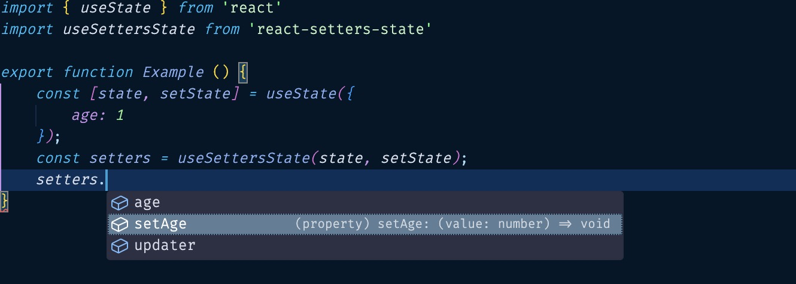

# react-setters-state

Convert your state to setters.



## Usage

### Basic Usage

```ts
import useSettersState from "react-setters-state";

export function Example() {
  const stateWithSetters = useSettersState({
    age: 1,
  });
}
```

### With a custom updater

```ts
import { useState } from "react";
import useSettersState from "react-setters-state";

export function Example() {
  const [state, setState] = useState({
    age: 1,
  });
  const stateWithSetters = useSettersState(state, setState);
}
```

## API

### useSettersState(state, updater, setterKeyPrefix)

```ts
useSettersState<TState extends object, TUpdater extends (cb: (prev: TState) => TState) => void, TPrefixKey extends string = "set">(state: TState, updater: TUpdater, setterKeyPrefix?: TPrefixKey): ISettersState<TState, TUpdater, TPrefixKey>;
```

| parameter       | required | type                                   | description                                                                               |
| --------------- | -------- | -------------------------------------- | ----------------------------------------------------------------------------------------- |
| state           | true     | object                                 | input state.                                                                              |
| updater         | false    | (cb: (prev: TState) => TState) => void | a higher order function like `setState` that will receive a `cb` function to update state |
| setterKeyPrefix | false    | string                                 | the method prefix string of setters, default to `"set"`                                   |
