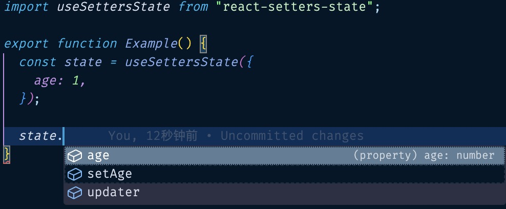

# react-setters-state

Convert your state to setters.

## Usage

```ts
import { useState } from "react";
import useSettersState from "react-setters-state";

export function Example() {
  const [state, setState] = useState({
    age: 1,
  });
  const setters = useSettersState(state, setState);
}
```

Has a good type hint.



## API

### useSettersState(state, updater, setterKeyPrefix)

```ts
useSettersState<TState extends object, TUpdater extends (cb: (prev: TState) => TState) => void, TPrefixKey extends string = "set">(state: TState, updater: TUpdater, setterKeyPrefix?: TPrefixKey): ISettersState<TState, TUpdater, TPrefixKey>;
```

- state: the state of setters.

- updater: a updater received a `cb` function to update state.

- setterKeyPrefix?: the method prefix name of setters, default to `set`
